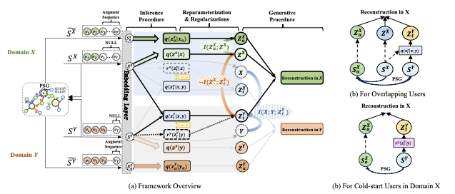

# i²VAE: Interest Information Augmentation with Variational Regularizers for Cross-Domain Sequential Recommendation

This repository provides the implementation for our UAI 2025 paper:

> **i²VAE: Interest Information Augmentation with Variational Regularizers for Cross-Domain Sequential Recommendation**  
> *Xuying Ning, Wujiang Xu, Tianxin Wei, Xiaolei Liu*  
> [Paper Link](https://arxiv.org/abs/2405.20710)

---

## 🔍 Motivation

Cross-domain sequential recommendation (CDSR) faces severe challenges in modeling cold-start and long-tailed users due to limited overlapping behaviors and sparse interactions. To address these challenges, **i²VAE** introduces:

- Mutual information-based variational regularizers to learn **disentangled cross-domain interests**.
- A **pseudo-sequence generator (PSG)** that augments user behavior with retrieved candidate items.
- A **denoising regularizer** to filter out noisy pseudo interactions while retaining useful signals.

<p align="center">
  
</p>

---

## 📂 Dataset

The `dataset/` folder includes three preprocessed datasets used in the paper. The preprocessing follows [AMID (WWW 2024)](https://dl.acm.org/doi/abs/10.1145/3589334.3645351), and can be found in:

```bash
dataset/process/process_data.ipynb
```

The included datasets already contain pseudo-sequences generated using our PSG. If you wish to generate your own pseudo-sequences:

1. Clone and train the official [LightGCN](https://github.com/gusye1234/LightGCN-PyTorch.git) repository:
   ```bash
   git clone https://github.com/gusye1234/LightGCN-PyTorch.git
   cd LightGCN-PyTorch
   ```
2. Train on your domain data.
3. Run the callback script to generate pseudo-sequences:
   ```bash
   python callback.py
   ```

---

## 🚀 Running the Code

To train i²VAE with our settings:

```bash
sh train_ours.sh
```

Model checkpoints and logs will be saved to the corresponding output directories.

After training, you can process and evaluate the saved results using:

```bash
dataset/process/process_checkpoint.ipynb
```


---

## 🧪 Citation

If this repository helps your research, please cite us:

```bibtex
@inproceedings{Ning2024i2VAEII,
  title={i\${^2}\$VAE: Interest Information Augmentation with Variational Regularizers for Cross-Domain Sequential Recommendation},
  author={Xuying Ning and Wujiang Xu and Tianxin Wei and Xiaolei Liu},
  year={2024},
  url={https://api.semanticscholar.org/CorpusID:270199881}
}
```
